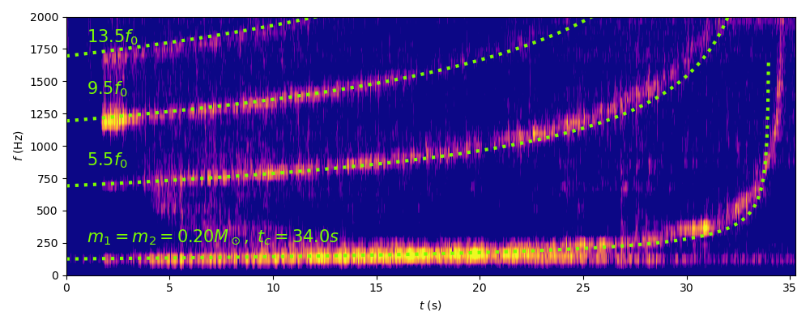

# GW Jug

The *.wav files contain the recorded sound for two tests. The corresponding spectrograms are given below. If they are short, they fit quite well with quadrupole GW signals, so the bottle's shape was correctly modelled and printed.

The fit is not so great with long signals, i.e. if you fill very slowly.

