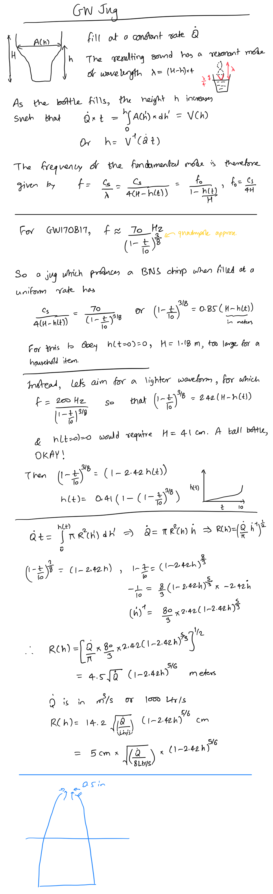

# GW Jug

The rough idea is sketched below

Prototype is ready! (Please forgive the ugly look. It was leaking.)

The *.wav files contain the recorded sound for two tests. The corresponding spectrograms are given below. If they are short, they fit quite well with quadrupole GW signals, so the bottle's shape was correctly modelled and printed.

The fit is not so great with long signals, i.e. if you fill very slowly.

To do:
* Write about
  + physics of GW emission from binary inspiral
  + the characteristic chirping signal
  + how a bottle chirps
  + mathematical formulation to design a bottle which chirps like an inspiraling bianry
  + prototypical results
* Write codes to solve for shape given chirp, and solve for chirp given shape
* Upload the CAD model
* Write codes for fitting recorded sound to find which masses it corresponded to
